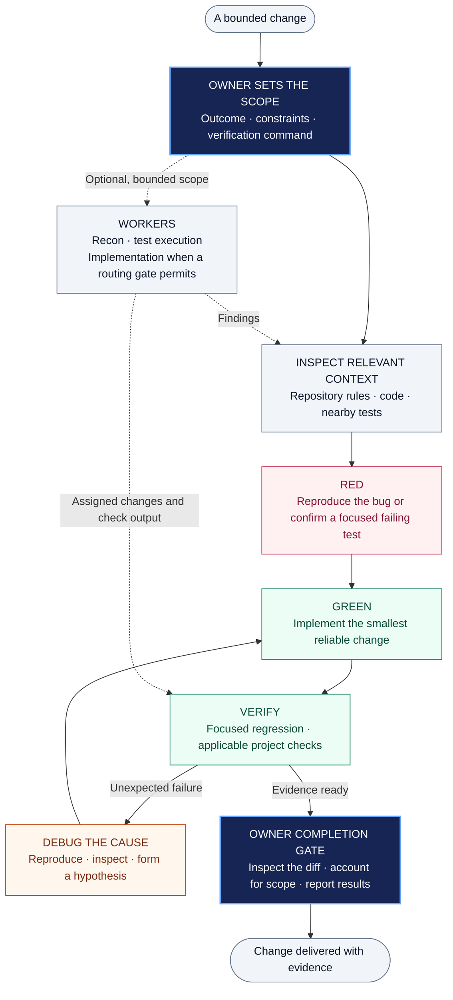

<h1 align="center">lean-engineering</h1>

<p align="center"><strong>Small changes. Clear ownership. Real evidence.</strong></p>

<p align="center">
  <a href="#one-line-install">Install</a> ·
  <a href="#how-it-works">How it works</a> ·
  <a href="#try-it">Try it</a> ·
  <a href="lean-engineering/SKILL.md">Skill source</a> ·
  <a href="evals/RESULTS-2026-09.md">Evidence</a> ·
  <a href="CHANGELOG.md">Changelog</a>
</p>

Understand the code. Reproduce the problem. Make a focused change. Show what passed.

`lean-engineering` is a portable Agent Skill for bug fixes, bounded features, refactors, and plan execution. It brings planning, test-driven development, root-cause debugging, and an evidence-based completion gate into the agent's workflow.

**Bounded workers are welcome.** The old blanket single-agent restriction is gone. One session owner remains accountable for the result, with exclusive file ownership when work is delegated. Recursive reviewer loops and parallel writers to the same files remain excluded.

Works with Codex, Claude Code, and other harnesses that load `SKILL.md`. Available tools and delegation controls depend on the host.

## One-Line Install

```bash
npx skills@latest add AaravKashyap12/lean-engineering --skill lean-engineering
```

Requires Node.js 22.20.0 or newer and npm (the requirement reported by skills 1.7.0). The [open skills installer](https://github.com/vercel-labs/skills) fetches the repository and selects only `lean-engineering`. Follow its prompts to choose your agent and installation scope. Add `-g` for a global installation.

The skill itself is Markdown with optional display metadata. It has no runtime dependencies, hooks, network clients, or executable helper scripts.

## How It Works

One accountable owner coordinates the work. Bounded workers can contribute evidence or an explicitly assigned implementation slice; the owner integrates the result and performs the completion gate.



Solid arrows show the engineering loop; dotted arrows show optional worker contributions. Worker implementation follows the same verification discipline. When test-first is inappropriate, the skill uses the strongest applicable fallback check and reports its limits.

## Use It When

- You need to fix a reproducible bug without accumulating speculative patches.
- You have a clear feature or refactor to implement in an existing repository.
- You want a compact plan and incremental changes backed by checks.
- You want useful delegation with clear ownership and an accountable completion report.

For destructive external actions, deployment, security-sensitive changes, migrations, or work that cannot be verified locally, the skill requires explicit user direction for that scope.

## Try It

```text
Use lean-engineering to fix this bug. Reproduce it, make the smallest reliable
change, run the relevant checks, and report what remains unverified.
```

```text
Use lean-engineering to implement this feature in small behavior slices.
Name the acceptance checks before editing and preserve unrelated changes.
```

```text
Use lean-engineering with efficiency-skill. Delegate bounded recon or test
execution where worthwhile. Keep file ownership explicit and the final
completion gate with the session owner.
```

## How Delegation Works

| Responsibility | Who handles it |
| --- | --- |
| Plan, production-code decisions, interpretation, and completion | Session owner |
| Tests, code search, call-site listings, and diff collection | Owner or bounded evidence-returning workers |
| A clear-shape implementation slice | Owner by default; a worker after a routing skill's delegation gate passes |
| Shared files | One owner at a time; hand ownership back before another agent edits |
| Consequential judgment and final completion gate | Session owner |
| Recursive reviewer loops or agents checking the orchestrator's own work | Excluded |

Without a routing skill, a mechanical or recon worker is allowed when its task is bounded, self-contained, and verifiable from returned evidence. Production-code implementation stays with the owner in that mode.

With a routing skill, implementation can also be delegated within an exclusive file scope. That permission does not extend to consequential work or competing writers.

## What Counts as Done

1. **Scope is explicit.** The intended behavior, touched area, and verification command are known before editing.
2. **Behavior has evidence.** Confirm a focused failure, make the change, and confirm the focused pass where test-first applies.
3. **Failures have a cause.** Investigate an unexpected failure before adding another fix.
4. **Relevant checks ran.** Use the applicable tests, type checks, lint, formatting, build, or runtime checks.
5. **The owner inspected the diff.** Account for every changed file and report actual outcomes, skipped checks, and blockers.

When a focused test is unavailable or inappropriate, the fallback order is: focused test, type check, build, recorded runtime probe, then recorded manual reproduction. A lower rung is a disclosed limitation. A green linter does not prove behavior, and a test suite does not replace scope inspection.

These are instructions for the agent, not guarantees of correctness. The skill does not supply missing compilers, databases, simulators, or credentials. Unavailable checks stay explicitly unverified.

## Pairing With Efficiency Skill

[Efficiency Skill](https://github.com/AaravKashyap12/efficiency-skill) governs whether delegation is worthwhile, which model tier to request, and how much reasoning effort to use. Lean Engineering governs ownership, implementation, verification, and completion.

State the execution mode before starting: owner inline, or owner with named bounded workers. Routing stays within Lean's file-ownership and consequential-work boundaries. Requested worker settings remain separate from confirmed execution evidence.

## Other Install Methods

Install globally for a specific host:

```bash
npx skills@latest add AaravKashyap12/lean-engineering --skill lean-engineering --agent codex --global
```

```bash
npx skills@latest add AaravKashyap12/lean-engineering --skill lean-engineering --agent claude-code --global
```

Or copy the complete `lean-engineering/` folder from a local clone:

| Harness | Destination |
| --- | --- |
| Codex | `~/.codex/skills/lean-engineering/` |
| Claude Code | `~/.claude/skills/lean-engineering/` |
| Other compatible agents | The directory their skill loader scans |

Compare customized installations before replacing them. Start a new task/session if your agent has not discovered the installed skill.

## Source of Truth

[lean-engineering/SKILL.md](lean-engineering/SKILL.md) is the canonical workflow. [agents/openai.yaml](lean-engineering/agents/openai.yaml) supplies optional Codex display metadata. This README explains installation and usage; it does not add a second workflow.

Installing a skill does not authorize deployments, publishing, migrations, secret access, or other external changes. Follow the user's task, preserve unrelated work, and respect the host's higher-priority instructions.

## Validation and Limitations

Version 0.2.0 replaced the blanket subagent ban with the owner-and-workers model while retaining TDD, root-cause debugging, and deterministic completion checks. See the [changelog](CHANGELOG.md).

Behavior cases and the credited standard-library fixture are in [evals/README.md](evals/README.md). Results are recorded separately from package checks. No comparative improvement in code quality, costs, or production safety is established by this release. A blocked or unrun evaluation is never a pass.

## Pre-launch evaluation status

Format, protected-content, consistency, and fixture checks passed. The Codex behavior batch recorded 9/9 full passes: two runs each of L-a, L-c, L-e, and L-f, and one run of the paired case L-d with Efficiency Skill, whose cheap-tier worker model was confirmed from the Codex rollout. L-b and L-g remain pending. This is not a comparative quality/cost benchmark.

[Recorded results and limitations](evals/RESULTS-2026-09.md) · [Run ledger](evals/results-2026-09.csv). Claude Code runs remain blocked by provider failures; they are not labeled as passes.

## Repository Layout

```text
lean-engineering/
  SKILL.md                 Canonical engineering workflow
  agents/openai.yaml       Optional Codex display metadata
evals/                     Cases, fixtures, runbook, and recorded evidence
README.md                  Installation and usage
CHANGELOG.md               Release history
LICENSE                    MIT license
```

## Contributing

Open an issue or pull request with a concrete failure case, the current behavior, the proposed instruction change, and a check that distinguishes improvement from extra process. Keep changes small; do not add dependencies or orchestration layers without a demonstrated need. Never include credentials or private customer data.

## License

[MIT](LICENSE). Copyright 2026 Aarav Kashyap Singh.
